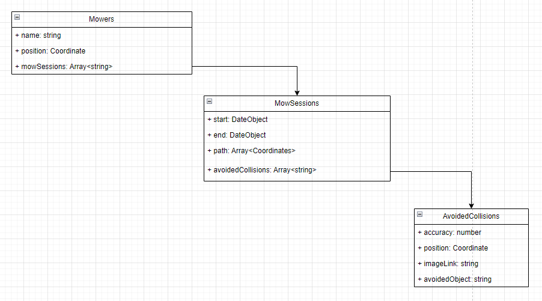

## Running the server locally
To run the server you'll need a machine with NodeJS v17.1.0 or newer.
1.  run ```npm install``` (inside project root directory) to install all package dependacies.
2.  run ```node index.js``` to start the server, the port which the server is hosted on can be found in the console.
3.  connect to the server using the link ```http://localhost:PORT``` (PORT will most likely be 3000)


## Firebase
As other teams were dependant on the API routes, it was important to quickly build the backend, thus Firebase was used. 
### Firestore
To store all user data Firestore was used. 
The architecture of the database can be seen in Figure 1 below.

<p style="text-align: center;">Figure 1 : Image depicting database structure</p>

### Storage
Firebase Storage was used to upload and host the avoidedCollision images. 
### Authentication
Authentication was considered when building the application, however. As security was not a priority according to the high level requirements, we decided to instead invest time into creating a working prototype of the mower, app and backend. 
## Google Vision API
Google Vision API is used to detect what object the mower avoided. The image processing takes place in the cloud, and the result is directly stored in Firestore. 

## API Host - Deta
The API is hosted on [Deta](https://docs.deta.sh/docs/home/) using a [Micro](https://docs.deta.sh/docs/micros/about) in combination with NodeJS to run the web server. Clients can later communicate with the server using the link - [https://tgin13-1-q1387758.deta.app](https://tgin13-1-q1387758.deta.app).

In order to communicate with the server an ```x-api-key``` header has to be sent in combination with the HTTP request. 


## Architecture

The backend of {PROJECT NAME} is structured using a three-layered architecture, which includes the Presentation Layer, Business Logic Layer, and Data Access Layer. With this approach, we ensure that the different layers are de-coupled. Each layer has its own responsibilities:

1. **Presentation-Layer**: Is responsible for exposing the REST-API and handling the HTTP requests and responses. This is done through routers. This layer depends on the business-logic-layer to handle logic.
2. **Business-Logic-Layer**: Is responsible for handling the logic such as calculating and handling the collisions and positions. When a record needs to be made on the database, this layer depends on the data-access-layer 
3. **Data-Access-Layer**: Is responsible for handling the database operations with Google Firebase & Google Cloud Storage.

Figure 1 below shows a visual representation of the backend architecture for {PROJECT NAME}.

The backend is built using `Node.js` and Express, with ES modules (it uses the `.mjs` extensions instead of `.js`).

## Dependency Injection

The dependency injection (DI) is implemented using the Awilix package. This allows us to manage dependencies between the different layers. To achieve our DI, the following steps were taken:
1. Using the Awilix package, a container was created which will manage ethe dependencies.
2. The different dependencies from the layers were registered in the container.
3. The contanier was exported for other files to get access to it.
4. `app.mjs` receieves the dependencies, uses the routers and passes the dependencies to the exported default function.
5. Routers are functions which accept dependencies in their arguments.
6. Services and repositories are classes that accept dependencies in their constructors.

